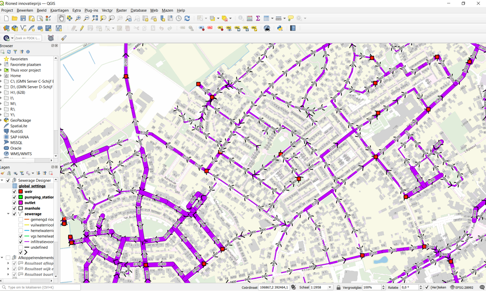
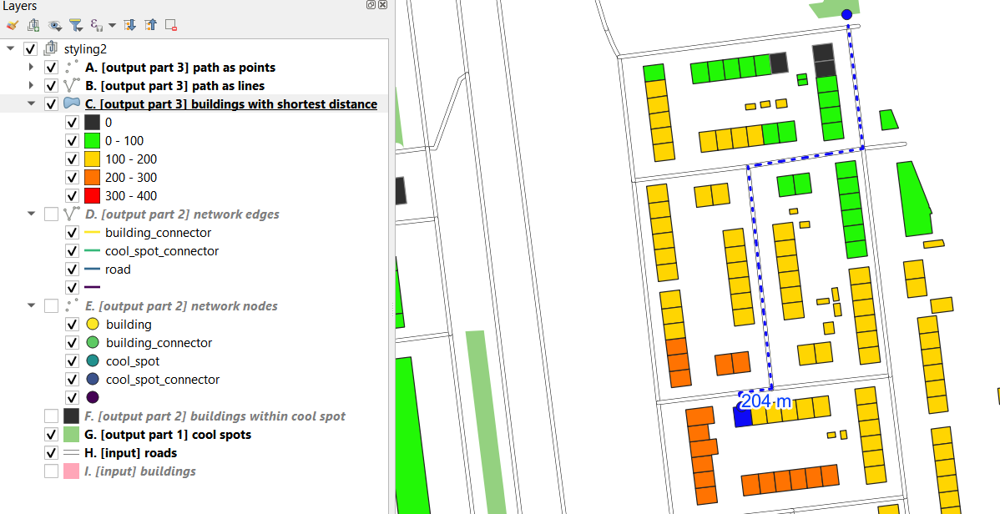

# Pizzacursus Python
This repository is used to store code material for NenS pizzacursussen (pizza courses).

## Practice course material by using Binder
This folder contains Jupyter notebooks and an enviroment configuration. Using Binder we can open these notebooks in an executable environment, making the code immediately reproducible by anyone.

## Pizzacursus netwerk en GEO-analyses in Python

Als adviseurs rekenen we nogal wat door. Veel van onze adviezen komen voort uit het gebruik van onze eigen tooling. Deze tools zijn soms gebouwd door adviseurs die hier niet meer werken. Weten we eigenlijk wel hoe (goed) deze tools werken? Zijn ze uitgebreid getest? Wat zijn de limitaties? Wie onderhoud de tools?

Genoeg vragen die we ook allemaal niet binnen het tijdsbestek van deze cursus kunnen beantwoorden. Wat ik wel wil bereiken met deze cursus is enthousiasme voor het vak “toolmakerij” en jullie wat basics meegeven. Het zou voor onze professionaliteit gunstig zijn als we de zorg over deze tools over een breder gedeelte van de organisatie kunnen dragen.

We gaan ons focussen op GIS en netwerk analyses in Python.
* Hoe kunnen we efficient omgaan met ruimtelijke filters of muteeracties?
* Hoe kunnen we geografische gegevens omzetten in netwerken en hiermee analyses doen?
 
Een bekend voorbeeld is de Afstand-tot-koelte kaart, waarbij we parkjes, panden, wegen en voetpaden koppelen in 1 netwerk. Met een netwerkanalyse kunnen we de kortste (of snelste) wandelroute vinden naar een koele plek. Een ander voorbeeld is de SewerageDesigner, waarbij we een lijnennetwerk creeeren van leidingen. Op basis van een piekbui-intensiteit en (geautomatiseerde) sommetjes kunnen we een schetsontwerp aanleveren van het rioolstelsel met minimaal benodigde diameters en aanlegdieptes.

Klik op bovenstaande "binder badge" om de binder op te starten en te beginnen aan de cursus.

